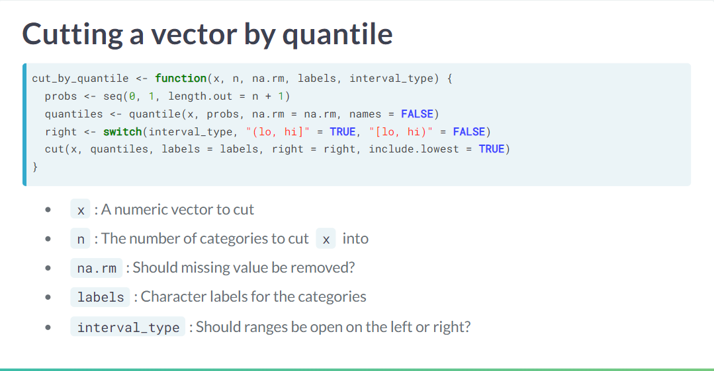

```{r setup, include=FALSE}
knitr::opts_chunk$set(echo = TRUE)
library(tidyverse)
```

## R Writing function

Check arguments to function:

```{r}

args(median)


```


Example 2:

```{r}

gold_medals <- c("en")

# Note the arguments to rank()
args(rank)

# Rewrite this function call, following best practices
rank("keep","min",x=-gold_medals)
```


```{r}
# Note the arguments to rank()
args(rank)

# Rewrite this function call, following best practices
rank(gold_medals , na.last =  "keep", ties.method = "min")


```


## Simple function
Building a simple function

```{r}
coin_sides <- c("head", "tail")

# Sample from coin_sides once
sample( coin_sides, size = 1)

# Your script, from a previous step
coin_sides <- c("head", "tail")
sample(coin_sides, 1)

# Paste your script into the function body
toss_coin <- function() {
  coin_sides <- c("head", "tail")
sample(coin_sides, 1)
  
}

```

Part Two
```{r}

# The function taks one argument
toss_coin <- function( n_flips ) {
  coin_sides <- c("head", "tail")
  sample(coin_sides, n_flips ,replace = T)
}

# Generate 10 coin tosses
toss_coin( n_flips = 10)


?sample
```

```{r}
# Update the function so heads have probability p_head
toss_coin <- function(n_flips, p_head) {
  coin_sides <- c("head", "tail")
  # Define a vector of weights
  weights <- c(p_head, (1-p_head) )
  # Modify the sampling to be weighted
  sample(coin_sides, n_flips, prob =  weights ,replace = TRUE)
}

# Generate 10 coin tosses
toss_coin(10, p_head = 0.8)


```


### Regression with function

```{r}
# Write a function to run a Poisson regression
# Run a generalized linear regression 
run_poisson_regression <- function(formula, data) {
glm(
  # Model no. of visits vs. gender, income, travel
  #n_visits ~ gender + income + travel, 
  formula = formula,
  # Use the snake_river_visits dataset
  data = data, 
  # Make it a Poisson regression
  family = "poisson"
  )  
}
```

```{r}
library(COUNT)

data("loomis")

head(loomis)


```

## Default arguments

```{r}
args(median)

# 
library(jsonlite)


args(fromJSON)

# Alternativ: use match.arg(alternative)
args(prop.test)


```




```{r}
cut_by_quantile <- function( x, n, na.rm, labels, interval_type) {
  
  
  probs <- seq(0,1, length.out = n+1);
  quantile <- quantile(x, probs, na.rm = T, names = FALSE);
  right <- swith(interval_type, "(lo,hi]" = T, "[lo, hi)" = F);
  cut( x, quantile, labels = labels, right = right, include.lowest = T);
  
  
}


```

```{r}
# Set the default for n to 5
cut_by_quantile <- function(x, n = 5,  na.rm, labels, interval_type) {
  probs <- seq(0, 1, length.out = n + 1)
  qtiles <- quantile(x, probs, na.rm = na.rm, names = FALSE)
  right <- switch(interval_type, "(lo, hi]" = TRUE, "[lo, hi)" = FALSE)
  cut(x, qtiles, labels = labels, right = right, include.lowest = TRUE)
}


# Set the default for na.rm to FALSE
cut_by_quantile <- function(x, n = 5, na.rm = FALSE, labels = NULL, interval_type) {
  probs <- seq(0, 1, length.out = n + 1)
  qtiles <- quantile(x, probs, na.rm = na.rm, names = FALSE)
  right <- switch(interval_type, "(lo, hi]" = TRUE, "[lo, hi)" = FALSE)
  cut(x, qtiles, labels = labels, right = right, include.lowest = TRUE)
}


cut_by_quantile <- function(x, n = 5, na.rm = FALSE, labels = NULL, 
                            interval_type = c("(lo, hi]", "[lo, hi)")) {
  # Match the interval_type argument
  interval_type <- match.arg(interval_type)
  probs <- seq(0, 1, length.out = n + 1)
  qtiles <- quantile(x, probs, na.rm = na.rm, names = FALSE)
  right <- switch(interval_type, "(lo, hi]" = TRUE, "[lo, hi)" = FALSE)
  cut(x, qtiles, labels = labels, right = right, include.lowest = TRUE)
}


# Remove the n argument from the call
cut_by_quantile(
  n_visits, 
  #n = 5, 
  #na.rm = FALSE, 
  #labels = c("very low", "low", "medium", "high", "very high"),
  interval_type = "(lo, hi]"
)


# Remove the interval_type argument from the call
cut_by_quantile(n_visits)
```


## Passing arguments between functions

```{r}
library(tidyverse);
std_and_poor500 <- readRDS("std_and_poor500_with_pe_2019-06-21.rds") %>% as.tibble()


# From previous steps
get_reciprocal <- function(x) {
  1 / x
}
calc_harmonic_mean <- function(x) {
  x %>%
    get_reciprocal() %>%
    mean() %>%
    get_reciprocal()
  
    # Alternativ function:
    # h_m <- 1/mean( get_reciprocal(x), na.rm = T)
    # return(h_m);
}


std_and_poor500 %>% 
  # Group by sector
  group_by(sector) %>% 
  # Summarize, calculating harmonic mean of P/E ratio
  summarise(hmean_pe_ratio = calc_harmonic_mean(pe_ratio))


```


## Returning an Error if something goes wrong:


```{r}
calc_geo_mean <- function(x, na.rm =na.rm ) {
  
  x %>% 
    log() %>% 
    mean( ) %>% 
    exp()
} 


calc_geo_mean(seq(1:100));

calc_geo_mean( letters[1:10]);

calc_geo_mean <- function(x, na.rm =na.rm ) {
  
  if( !is.numeric(x)) { 
    stop("x is not of class numeric. It has class: ", class(x), "." )}
  
  x %>% 
    log() %>% 
    mean( ) %>% 
    exp()
} 

calc_geo_mean( letters[1:10]);

```

### Use of assert_is*

```{r}
calc_harmonic_mean <- function(x, na.rm = FALSE) {
  # Assert that x is numeric
  assert_is_numeric(x);
  if( any(is_non_positive(x), na.rm = T)) {
    
    stop("x contains non-pos. so harmoic mean makes no sense.")
  }
  na.rm <- coerce_to(use_first(na.rm), target_class = "logical");
  x %>%
    get_reciprocal() %>%
    mean(na.rm = na.rm) %>%
    get_reciprocal()
}

# See what happens when you pass it strings
calc_harmonic_mean(std_and_poor500$sector)
```


```{r}


```


